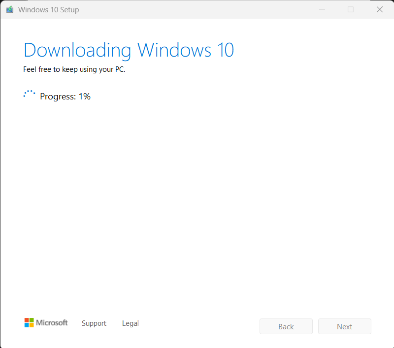
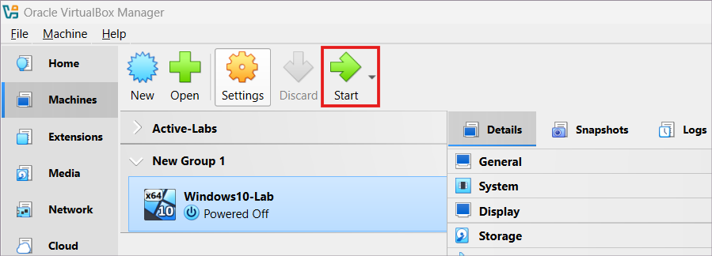
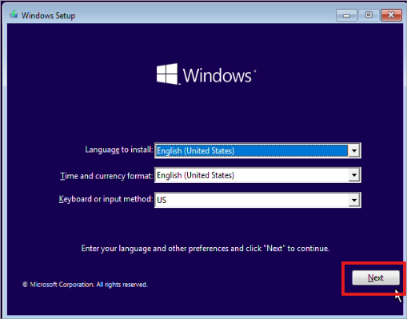
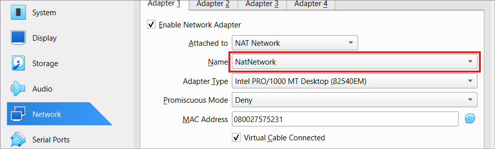
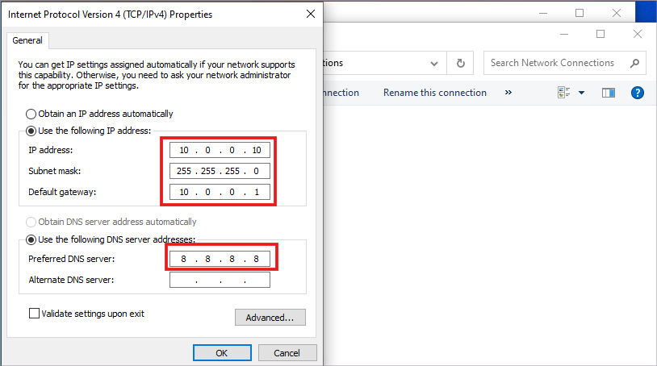
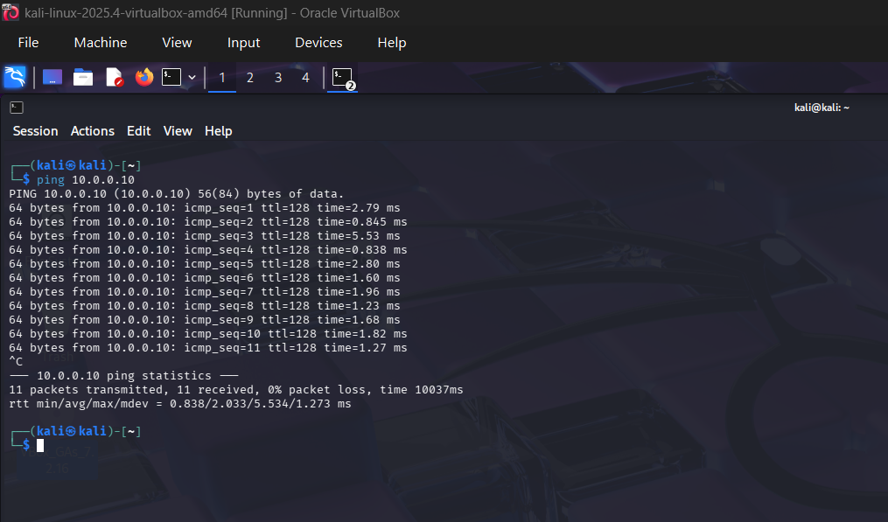
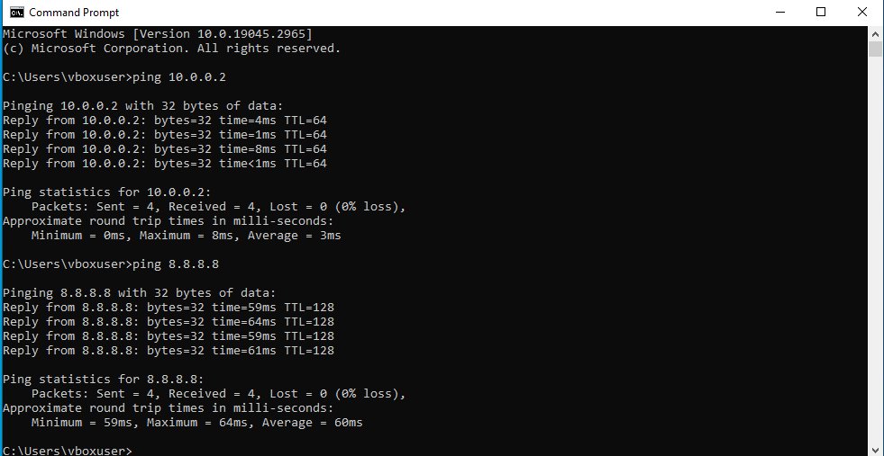

# NETWORKWALKS-B083D-WK1-PM1x-SETTING UP WINDOWS !) IN VIRTUALBOX (Networked with Kali Linux)

**Program:** NETWORKWALKS CYBERSECURITY INTERNSHIP — Week 1
**Author:** Patrick Alabi

## Project Goal

Set up a Windows 10 virtual machine inside VirtualBox, place it on the same NAT Network as an existing Kali Linux VM, and confirm bidirectional connectivity between both machines and the internet.

This lab lays the networking foundation for later, more advanced exercises (attack simulation, detection, and incident response) that require a Windows target and a Kali attacker box talking to each other on an isolated virtual network.

## Requirements

- VirtualBox already installed (same instance used for the Kali VM)
- At least 40 GB free disk space
- At least 4 GB RAM to spare for the VM
- Kali Linux VM already configured on a NAT Network, IP `10.0.0.2`

## Network Summary

| Setting | Value |
|---|---|
| Network type | VirtualBox NAT Network |
| Kali Linux IP | 10.0.0.2 / 24 |
| Windows 10 IP | 10.0.0.10 / 24 |
| Gateway | 10.0.0.1 |
| DNS | 8.8.8.8 |

## What Was Done

1. **Downloaded the Windows 10 ISO** via the Media Creation Tool from Microsoft's official download page (with a documented backup method using browser device emulation for cases where Microsoft doesn't show a direct ISO option).

3. **Created a new VM in VirtualBox** — named `Windows10-Lab`, attached the ISO, set OS type to Windows 10 (64-bit), allocated 4096 MB RAM and 2 CPUs, and created a 40 GB VDI virtual disk.

5. **Installed Windows 10** from the mounted ISO using a custom installation onto the new virtual disk.

7. **Configured the network adapter** to NAT Network, matching the same NAT Network used by the Kali VM.

9. **Set a static IP inside Windows** (`10.0.0.10/24`, gateway `10.0.0.1`, DNS `8.8.8.8`) via the adapter's TCP/IPv4 properties.

11. **Validated connectivity** in both directions:
   - Windows → Kali: `ping 10.0.0.2`
   - Windows → Internet: `ping 8.8.8.8`
   - Kali → Windows: `ping 10.0.0.10`

All three pings succeeded, confirming the Windows 10 VM and Kali Linux VM can reach each other and the internet over the shared NAT Network.

## Skills Demonstrated

- Virtual machine provisioning and resource allocation (VirtualBox)
- Guest OS installation and configuration
- Virtual networking (NAT Network configuration across multiple VMs)
- Static IP addressing and TCP/IPv4 configuration in Windows
- Network troubleshooting and connectivity validation (ICMP/ping)

## Notes

This environment (Kali + Windows 10 on a shared NAT Network) is the base lab setup used for subsequent SOC and offensive-security exercises in this internship track.

---
*Part of an ongoing cybersecurity portfolio — SOC analysis, penetration testing, and OSINT labs documented as they're completed.*
